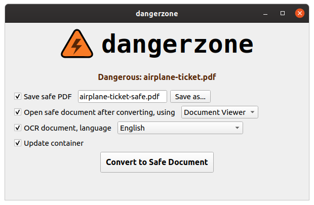

# dangerzone

Take potentially dangerous PDFs, office documents, or images and convert them to a safe PDF.



Dangerzone works like this: You give it a document that you don't know if you can trust (for example, an email attachment). Inside of a sandbox, dangerzone converts the document to a PDF (if it isn't already one), and then converts the PDF into raw pixel data: a huge list of of RGB color values for each page. Then, in a separate sandbox, dangerzone takes this pixel data and converts it back into a PDF.

Some features:

- Sandboxes don't have network access, so if a malicious document can compromise one, it can't phone home
- Dangerzone can optionally OCR the safe PDFs it creates, so it will have a text layer again
- Dangerzone compresses the safe PDF to reduce file size
- After converting, dangerzone lets you open the safe PDF in the PDF viewer of your choice, which allows you to open PDFs and office docs in dangerzone by default so you never accidentally open a dangerous document

Dangerzone was inspired by [Qubes trusted PDF](https://blog.invisiblethings.org/2013/02/21/converting-untrusted-pdfs-into-trusted.html), but it works in non-Qubes operating systems and sandboxes the document conversion in [podman](https://podman.io/) containers instead of virtual machines. Podman is like docker but more secure -- it doesn't require a privileged daemon, and containers can be launched without root.

Right now, dangerzone only works in Linux, but the goal is to [get it working in macOS](https://github.com/firstlookmedia/dangerzone/issues/1) so it can be more useful to journalists (who tend to <3 using Macs).

## Development environment

You need [podman](https://podman.io/getting-started/installation) ([these instructions](https://kushaldas.in/posts/podman-on-debian-buster.html) are useful for installing in Debian or Ubuntu).

You also need python3, pipenv, and Qt5.

Run locally:

```
pipenv run ./dev_script/dangerzone
```

Create a .deb:

```
pipenv run ./install/linux/build_deb.py
```