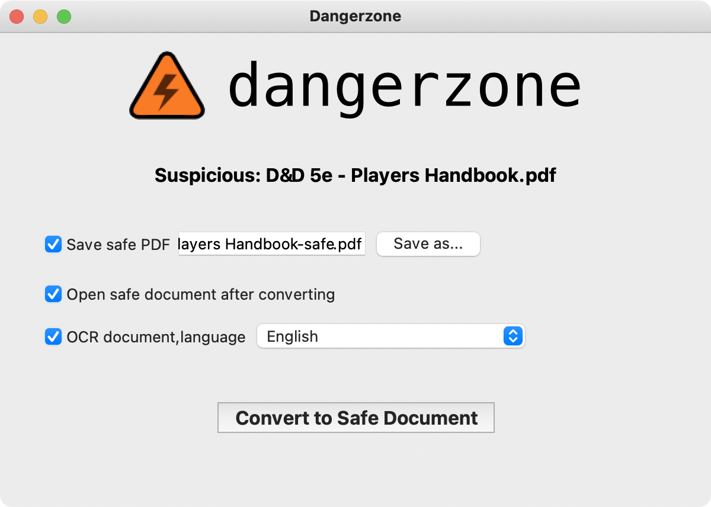
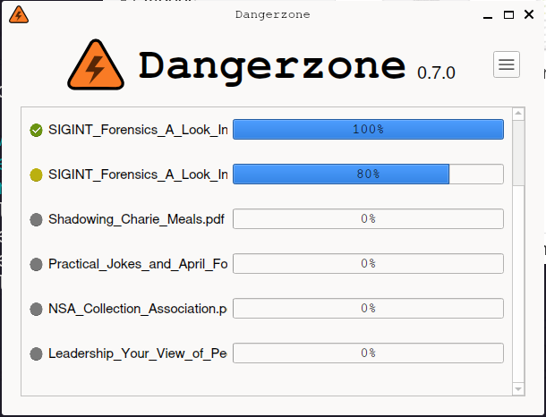

# Dangerzone

Take potentially dangerous PDFs, office documents, or images and convert them to a safe PDF.

|  | 
|--|--|

Dangerzone works like this: You give it a document that you don't know if you can trust (for example, an email attachment). Inside of a sandbox, Dangerzone converts the document to a PDF (if it isn't already one), and then converts the PDF into raw pixel data: a huge list of RGB color values for each page. Then, in a separate sandbox, Dangerzone takes this pixel data and converts it back into a PDF.

_Read more about Dangerzone in the [official site](https://dangerzone.rocks/about.html)._

## Getting started

### MacOS
- Download [Dangerzone 0.5.1 for Mac (Apple Silicon CPU)](https://github.com/freedomofpress/dangerzone/releases/download/v0.5.1/Dangerzone-0.5.1-arm64.dmg)
- Download [Dangerzone 0.5.1 for Mac (Intel CPU)](https://github.com/freedomofpress/dangerzone/releases/download/v0.5.1/Dangerzone-0.5.1-i686.dmg)

You can also install Dangerzone for Mac using [Homebrew](https://brew.sh/): `brew install --cask dangerzone`

> **Note**: you willl also need to install [Docker Desktop](https://www.docker.com/products/docker-desktop/).
> This program needs to run alongside Dangerzone at all times, since it is what allows Dangerzone to
> create the secure environment.

### Windows

- Download [Dangerzone 0.5.1 for Windows](https://github.com/freedomofpress/dangerzone/releases/download/v0.5.1/Dangerzone-0.5.1.msi)

> **Note**: you will also need to install [Docker Desktop](https://www.docker.com/products/docker-desktop/).
> This program needs to run alongside Dangerzone at all times, since it is what allows Dangerzone to
> create the secure environment.

### Linux

See [installing Dangerzone](INSTALL.md#linux) for adding the Linux repositories to your system.

## Some features

- Sandboxes don't have network access, so if a malicious document can compromise one, it can't phone home
- Dangerzone can optionally OCR the safe PDFs it creates, so it will have a text layer again
- Dangerzone compresses the safe PDF to reduce file size
- After converting, Dangerzone lets you open the safe PDF in the PDF viewer of your choice, which allows you to open PDFs and office docs in Dangerzone by default so you never accidentally open a dangerous document

Dangerzone can convert these types of document into safe PDFs:

- PDF (`.pdf`)
- Microsoft Word (`.docx`, `.doc`)
- Microsoft Excel (`.xlsx`, `.xls`)
- Microsoft PowerPoint (`.pptx`, `.ppt`)
- ODF Text (`.odt`)
- ODF Spreadsheet (`.ods`)
- ODF Presentation (`.odp`)
- ODF Graphics (`.odg`)
- Hancom HWP (Hangul Word Processor) (`.hwp`, `.hwpx`)
  * Not supported on
    [Qubes OS](https://github.com/freedomofpress/dangerzone/issues/494)
- Jpeg (`.jpg`, `.jpeg`)
- GIF (`.gif`)
- PNG (`.png`)

Dangerzone was inspired by [Qubes trusted PDF](https://blog.invisiblethings.org/2013/02/21/converting-untrusted-pdfs-into-trusted.html), but it works in non-Qubes operating systems. It uses containers as sandboxes instead of virtual machines (using Docker for macOS and Windows, and [podman](https://podman.io/) on Linux).

Set up a development environment by following [these instructions](/BUILD.md).

# License and Copyright

Licensed under the AGPLv3: [https://opensource.org/licenses/agpl-3.0](https://opensource.org/licenses/agpl-3.0)

Copyright (c) 2022-2024 Freedom of the Press Foundation and Dangerzone contributors
Copyright (c) 2020-2021 First Look Media

## FAQ

### "I'm experiencing an issue while using Dangerzone."

Dangerzone gets updates to improve its features _and_ to fix problems. So, updating may be the simplest path to resolving the issue which brought you here. Here is how to update:

1. Check which version of Dangerzone you are currently using: run Dangerzone, then look for a series of numbers to the right of the logo within the app. The format of the numbers will look similar to `0.4.1`
2. Now find the latest available version of Dangerzone: go to the [download page](https://dangerzone.rocks/#downloads). Look for the version number displayed. The number will be using the same format as in Step 1.
3. Is the version on the Dangerzone download page higher than the version of your installed app? Go ahead and update.

### "I get `invalid json returned from container` on MacOS Big Sur or newer (MacOS 11.x.x or higher)"

Are you using the latest version of Dangerzone? See the FAQ for: "I'm experiencing an issue while using Dangerzone."

You _may_ be attempting to convert a file in a directory to which Docker Desktop does not have access. Dangerzone for Mac requires Docker Desktop for conversion. Docker Desktop, in turn, requires permission from MacOS to access the directory in which your target file is located.

To grant this permission:

1. On MacOS 13, choose Apple menu > System Settings. On lower versions, choose System Preferences.
2. Tap into Privacy & Security in the sidebar. (You may need to scroll down.)
3. In the Privacy section, tap into Files & Folders. (Again, you may need to scroll down.)
4. Scroll to the entry for Docker. Tap the > to expand the entry.
5. Enable the toggle beside the directory where your file is present. For example, if the file to be converted is in the Downloads folder, enable the toggle beside Downloads.

(Full Disk Access permission has a similar effect, but it's enough to give Docker access to _only_ the directory containing the intended file(s) to be converted. Full Disk is unnecessary. As of 2023.04.28, granting one of these permissions continues to be required for successful conversion. Apologies for the extra steps. Dangerzone depends on Docker, and the fix for this issue needs to come from upstream. Read more on [#371](https://github.com/freedomofpress/dangerzone/issues/371#issuecomment-1516863056).)
