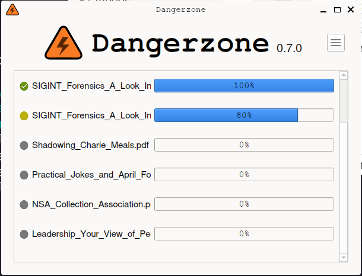

# Dangerzone

Take potentially dangerous PDFs, office documents, or images and convert them to a safe PDF.


|  | 
|--|--|

Dangerzone works like this: You give it a document that you don't know if you can trust (for example, an email attachment). Inside of a sandbox, Dangerzone converts the document to a PDF (if it isn't already one), and then converts the PDF into raw pixel data: a huge list of RGB color values for each page. Then, outside of the sandbox, Dangerzone takes this pixel data and converts it back into a PDF.

_Read more about Dangerzone in the [official site](https://dangerzone.rocks/about/)._

## Documentation

The documentation lives at [docs.dangerzone.rocks](https://docs.dangerzone.rocks/).
Its source is under [`docs/`](docs/) in this repository:

* [Installation](docs/how-to/install.md) for macOS, Windows, Ubuntu, Debian, Fedora, Qubes OS, and Tails, and the [supported platforms](docs/reference/supported-platforms.md)
* [Tutorials](docs/tutorials/index.md) to get started
* [Development environment](docs/how-to/build-from-source.md) to build from source, and [how to contribute](docs/how-to/contribute.md)
* [Security policy](SECURITY.md) and [changelog](CHANGELOG.md)

Preview the site locally with `poetry install --with docs` followed by `make docs-serve`.

# License and Copyright

Licensed under the AGPLv3: [https://opensource.org/licenses/agpl-3.0](https://opensource.org/licenses/agpl-3.0)

```
Copyright © 2022–2024 Freedom of the Press Foundation and Dangerzone contributors
Copyright © 2020–2021 First Look Media
```

See also [THIRD_PARTY_NOTICE.md](THIRD_PARTY_NOTICE.md) for more information regarding the third-party software that Dangerzone depends on.
