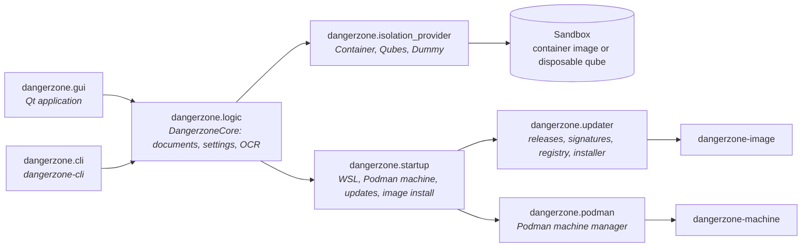

# Code architecture

This page explains how the code is architectured in Dangerzone.

It might as well be useful to also have a look at how [The Dangerzone repositories](project-repositories.md) come together.

## The pieces

### Core

* `dangerzone/logic.py`: `DangerzoneCore`, shared by the GUI and the CLI. It holds the list of `Document`s, the `Settings`, the OCR language table (`share/ocr-languages.json`), and drives conversions through an isolation provider.
* `dangerzone/document.py`: `Document`, with input and output paths, the `-safe.pdf` suffix, the `unsafe/` archive directory, and filename validation.
* `dangerzone/settings.py`: the `settings.json` singleton, see [Settings](../reference/settings.md).
* `dangerzone/startup.py`: the ordered startup tasks (install WSL, stop other Podman machines, init and start the machine, check for updates, install the sandbox image) with hooks the GUI and CLI implement to prompt the user.
* `dangerzone/conversion_errors.py`: the exit codes and limits shared with the sandbox, see [Sandbox protocol](../reference/sandbox-protocol.md).
* `dangerzone/errors.py`, `dangerzone/util.py`, `dangerzone/container_utils.py`: error types, resource paths (`share/` in development, platform paths when installed), Podman invocation and version checks.

### Isolation providers

`dangerzone/isolation_provider/` is the seam between the trusted host and the untrusted conversion. `base.py` implements the host side of the [sandbox protocol](../reference/sandbox-protocol.md): it streams the document in, reads pixels out with strict bounds, rebuilds PDF pages, and runs OCR in a pool of worker processes. The subclasses only know how to start and stop the process:

* `container.py`: runs the sandbox image with Podman and the hardening flags.
* `qubes.py`: calls `dz.Convert` in a disposable qube, see [Qubes OS integration](qubes-integration.md).
* `dummy.py`: a fake provider for development and tests (`--unsafe-dummy-conversion`).

### Updater

`dangerzone/updater/` implements [independent sandbox updates](sandbox-updates.md): `releases.py` (GitHub release checks and the update-check cooldown), `registry.py` (talking to ghcr.io), `signatures.py` and `cosign.py` (Cosign verification against the bundled key, the Rekor log index, archives for air-gapped machines), `installer.py` (deciding how to install the image on a given platform), and `cli.py` (the `dangerzone-image` command).

### Podman machines and Windows

`dangerzone/podman/` manages the Podman machine on macOS and Windows (`machine.py`, and `cli.py` for `dangerzone-machine`). `dangerzone/windows/` handles the Windows Subsystem for Linux installation.

### GUI

`dangerzone/gui/` is the PySide6 application: `main_window.py` (the windows, the document selection and settings widgets, the conversion list), `logic.py` (`DangerzoneGui`, PDF viewers, dialogs), `startup.py` (the GUI implementation of the startup tasks and prompts), `updater.py` (the update prompts), `log_window.py`, and `widgets.py`. See [Update notifications](update-notifications.md) for the design of the update UI.

## Around the code

* `share/`: resources shipped with the application: icons, the OCR language table, the Cosign and Rekor public keys, the seccomp profiles, `version.txt`, and `image-name.txt` (the sandbox image name).
* `install/`: packaging for each platform (`linux/build-deb.py`, `linux/build-rpm.py` and the spec, `macos/build-app.py`, `windows/build-app.bat` and the WiX sources), plus `setup-windows.py` and `debian/` at the root.
* `dev_scripts/`: `env.py` (containerized dev environments), `qa.py` (scripted QA), release helpers, the release notes templates, and `docs_cog.py` (the CLI help embedded in this site).
* `tests/`: pytest suite, with sample documents under `tests/test_docs/`.
* `dodo.py`: the [Doit](../how-to/release/build-with-doit.md) tasks that build release artifacts.
* `docs/`: this site.
