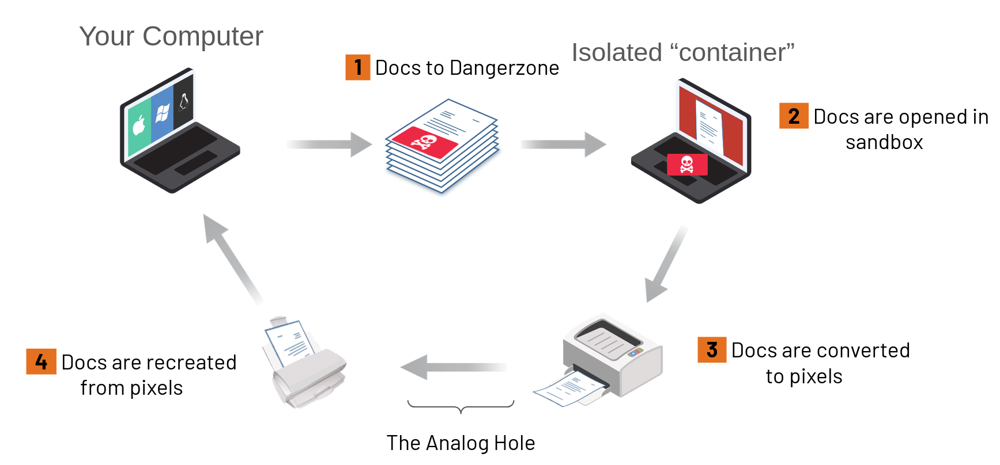

# How Dangerzone works

Dangerzone takes potentially dangerous PDFs, office documents, or images and converts them to a safe PDF. But how does that work?

## The core idea: flatten everything to pixels

A document format like PDF or DOCX is a small program as much as it is a picture of a page, and controlling what this program can do is hard: some embedded fonts can exploit security holes in the font renderer, for instance, and then escalate to executing code on your machine.

Dangerzone sidesteps this problem entirely. In a secure sandbox, the document will be converted to raw pixel data: a huge list of RGB color values for each page. Then, outside of the sandbox, Dangerzone takes this pixel data and converts it back into a PDF.

Converting to pixel data renders any embedded script ineffective: whatever the original document was hiding doesn't survive this step. Then, the safe PDF is rebuilt from those bitmaps by trusted code on your side of the fence, and so we can be sure it doesn't contain any script at all.

Dangerzone was inspired by [Qubes trusted PDF](https://blog.invisiblethings.org/2013/02/21/converting-untrusted-pdfs-into-trusted.html), which applies the same idea with virtual machines. Dangerzone brings it to non-Qubes operating systems by using containers as sandboxes.

## The sandbox

The sandbox is a container image, built and published separately in the [dangerzone-image](https://github.com/freedomofpress/dangerzone-image) repository. Dangerzone runs it with Podman:

* On Linux, with the system's Podman.
* On macOS and Windows, with a Podman that is embedded in the application and runs inside a small Linux virtual machine (a "Podman machine"). On Windows, that machine is a WSL distribution.

The container has no network access, so if a malicious document compromises it, it can't phone home. Inside the container, the conversion runs under [gVisor](https://gvisor.dev/), an application kernel written in Go that implements a substantial portion of the Linux system call interface. gVisor sits between the conversion tools and the real kernel: an exploit that takes over LibreOffice still has to break out of gVisor, then out of the container, before it reaches your system. We wrote about this design in a [blog post](https://dangerzone.rocks/news/2024-09-23-gvisor/).

The image is signed with Cosign and updated independently from Dangerzone, so that vulnerabilities in the tools inside it can be patched quickly. See [Independent sandbox updates](sandbox-updates.md).

## What's lost

Because the safe PDF is rebuilt from pixels, some information is lost to the process:

* Links, forms, bookmarks and embedded files are gone.
* Text is only searchable and selectable if you enable OCR, and unfortunately OCR is never perfect.
* Metadata is destroyed. For Dangerzone this is a feature: metadata is one of the two things it promises to remove. See [Security model](security-model.md).

For a document you receive from someone you don't trust, these are usually good trades.
