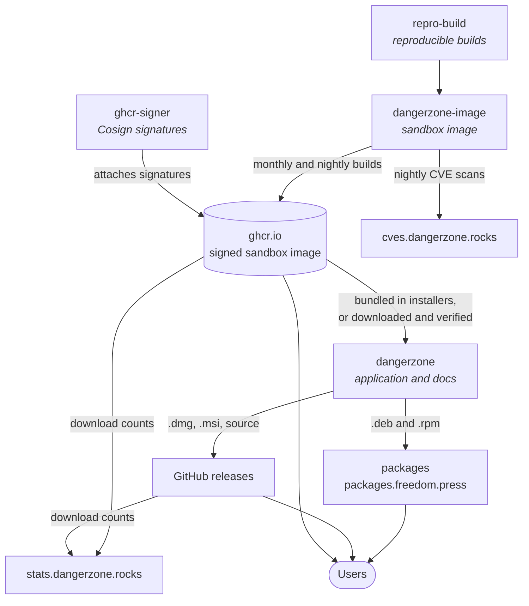

# The Dangerzone repositories

Dangerzone is more than one repository. The application, the sandbox image it runs, the packages users install, and the signatures that tie them together each live in their own place. This page gives contributors the bird's-eye view: what each repository or site is for, and how they fit together.

## The big picture

Every box in the graph is a link to the repository or site it stands for.

## The repositories

### [freedomofpress/dangerzone](https://github.com/freedomofpress/dangerzone)

The main repository: the desktop application (in Qt), the CLI tools, the packaging for every platform and this documentation site. Releases are tagged here and their installers are published on the [GitHub releases page](https://github.com/freedomofpress/dangerzone/releases).

### [freedomofpress/dangerzone-image](https://github.com/freedomofpress/dangerzone-image)

The sandbox: the container image that performs the document-to-pixels conversion, and the Python package that runs inside it. The image is published on a monthly basis to `ghcr.io/freedomofpress/dangerzone/v1`, with nightly builds under a testing namespace. Its CI builds the image reproducibly, attaches provenance attestations, runs the daily CVE scans, and publishes the security dashboard. Problems with a document format, a bundled tool, or a CVE inside the sandbox belong here. The interface between the application and the image is described in [Sandbox protocol](../reference/sandbox-protocol.md), and the update mechanism in [Independent sandbox updates](sandbox-updates.md).

### [freedomofpress/packages](https://github.com/freedomofpress/packages)

Storage for the `.deb` and `.rpm` packages, served on [packages.freedom.press](https://packages.freedom.press) (and on `packages-qa.freedom.press` for release candidates).

### [freedomofpress/ghcr-signer](https://github.com/freedomofpress/ghcr-signer)

Utilities to publish Cosign signatures for the sandbox image to the GitHub Container Registry without GitHub Personal Access Tokens. Signatures are prepared offline with the signing key, submitted as a pull request, verified by CI, and attached to the image by a workflow once merged. The blog post [The GHCR Signer](https://dangerzone.rocks/news/2026-05-26-ghcr-signer/) explains why this is needed and how it works. This is the step that lets Dangerzone [trust a downloaded sandbox image](sandbox-updates.md#why-you-can-trust-a-downloaded-image).

### [freedomofpress/repro-build](https://github.com/freedomofpress/repro-build)

A helper script to build bit-for-bit reproducible container images, by providing a build environment that is consistent across operating systems and container engines. `dangerzone-image` uses it so that anyone can rebuild the sandbox image and compare digests. The blog post [Reproducing the reproducible images](https://dangerzone.rocks/news/2026-03-02-repro-build/) tells the story, and [Reproducible builds](reproducible-builds.md) covers what is reproducible on the Dangerzone side.

### [freedomofpress/dangerzone-rs](https://github.com/freedomofpress/dangerzone-rs)

A rewrite of dangerzone in rust, currently in the works and not to be used yet.

## Websites

### [stats.dangerzone.rocks](https://stats.dangerzone.rocks)

Release statistics for the project aggregating data from the GitHub releases and the container registry. Generated by [freedomofpress/dangerzone-stats](https://github.com/freedomofpress/dangerzone-stats).

### [cves.dangerzone.rocks](https://cves.dangerzone.rocks)

The security dashboard: the results of the nightly [grype](https://github.com/anchore/grype) scans of the sandbox image, both for the development branch and the latest released image. This is the second line of defense described in the [security model](security-model.md). The dashboard is published from the `dangerzone-image` repository.

### [dangerzone.rocks](https://dangerzone.rocks) and this site

The official website, with downloads links and the blog. Built from [freedomofpress/dangerzone.rocks](https://github.com/freedomofpress/dangerzone.rocks). This documentation site is built from the `docs/` directory of the main repository and published at [docs.dangerzone.rocks](https://docs.dangerzone.rocks).
