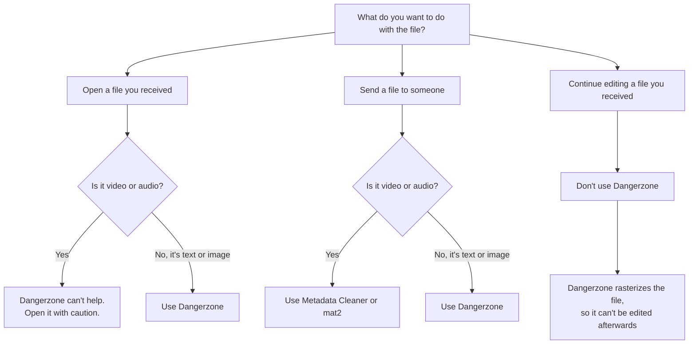

# When should I use Dangerzone?

Dangerzone is the right tool for some situations and the wrong tool for
others. The short rule:

!!! tip "Rule of thumb"

    Always use Dangerzone on text or image files you received from an
    external source, unless it is a video or audio file, or a document that
    you need to keep editing.

## Decision guide

## Use Dangerzone when...

* **You received a document or an image and want to open it.** This is the
  main use case: an email attachment, a file from a tip line, a download from
  a site you don't fully trust. Convert it, then open the safe PDF.
* **You want to send a document or an image without metadata.** The safe PDF
  carries none of the original metadata: no author name, no editing history,
  no camera model, no GPS position. Because it is rebuilt from pixels, it also
  carries no hidden layers, comments, or tracked changes.
* **You move a document from an untrusted environment to a trusted one.**
  For example from a machine used to browse the web to a machine that holds
  sensitive material. Converting on the way in keeps the trusted side clean.

## Don't use Dangerzone when...

* **You need to keep editing the document.** Dangerzone rasterizes the file:
  the result is a picture of each page. Formulas in a spreadsheet, macros in a
  Word document, form fields, and the text layout are all gone. If you must
  edit a document you don't trust, do it in a disposable environment instead.
* **The file is video or audio.** Dangerzone only handles documents and
  images (see [supported formats](../reference/supported-formats.md)). For
  removing metadata from media files, use
  [Metadata Cleaner](https://metadatacleaner.romainvigier.fr/) or
  [mat2](https://0xacab.org/jvoisin/mat2). For opening untrusted media, there
  is no Dangerzone equivalent. Open it with caution, preferably in a virtual
  machine.
* **You want to know whether a file is malicious.** Dangerzone can't tell you
  if a file is safe. It just creates a copy that is.
* **You need to protect a source from fingerprinting of the document's
  content.** Dangerzone removes metadata and the file's structure. It does
  not change what is visible on the page: printer tracking dots, watermarks,
  unique wording, or steganography survive, because they are part of the
  picture. See the [FAQ](faq.md#does-dangerzone-remove-watermarks-and-tracking-information).

## Examples

| Situation | What to do |
| --------- | ---------- |
| A source emails you a PDF | Use Dangerzone, then read the safe PDF |
| A colleague sends a spreadsheet you need to work on | Don't use Dangerzone. Open it in a disposable environment if you don't trust it |
| You photographed a document and want to publish it | Use Dangerzone to drop the camera metadata, after checking the picture itself for identifying details |
| Someone sends you a voice recording | Dangerzone can't help. Use Metadata Cleaner if you only need to strip metadata before sharing it |
| You downloaded a scanned form to print and sign | Use Dangerzone, then print the safe PDF |
