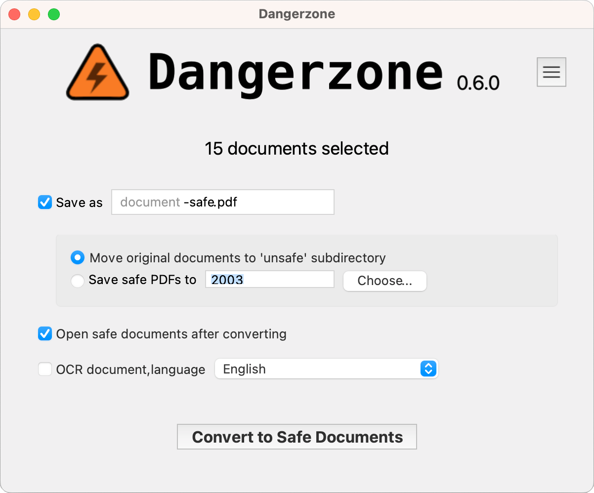
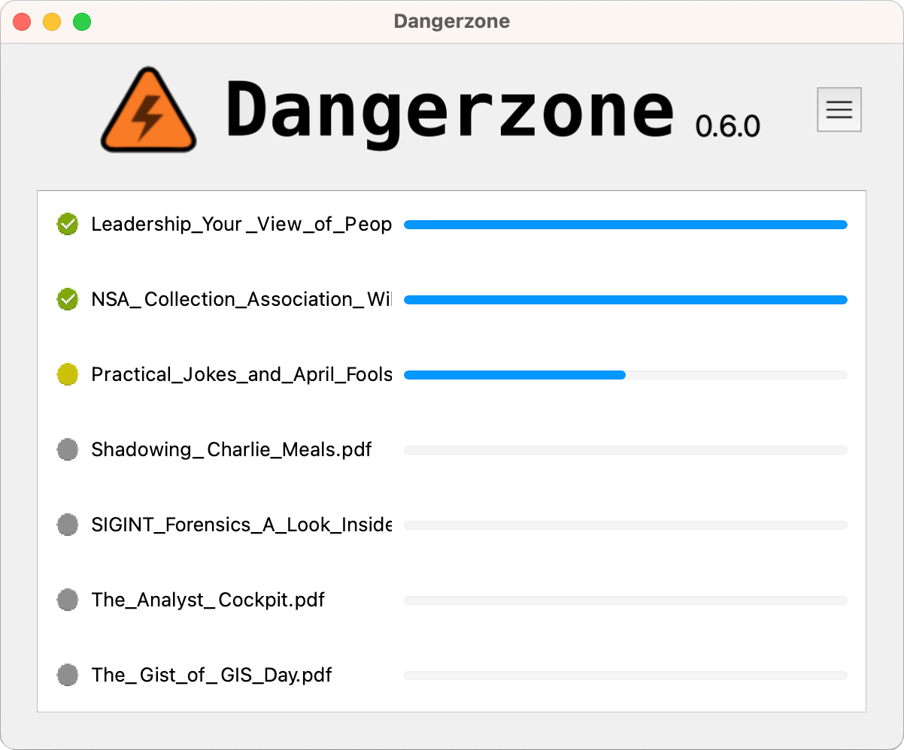

# What is Dangerzone, and why should I use it?

Dangerzone is an application that helps you sanitize documents into safe PDFs. This is useful in many cases, and has been thought at first for journalists and activists, who may be targetted by law enforcement and bad actors.

The project is currently maintained by the [Freedom of the Press Foundation](https://freedom.press).

It works like this:

1. You give it a document you don't know if you can trust (for example, an email attachment)
2. Inside of a sandbox, it converts it to raw pixel data (a huge list of RGB color values for each page)
3. Then, outside of the sandbox, it reassembles this pixel data and generates a PDF from it

## Some features

- Sandboxes don't have network access, so if a malicious document can compromise one, it can't phone home
- Dangerzone can optionally do character recognition on the safe PDFs it creates, so they are searcheable
- Dangerzone can convert [many types of documents](reference/supported-formats.md) into safe PDFs.

---

This documentation is organised in four sections. Pick the one that matches what you are trying to do.

-   :material-school:{ .lg .middle } __Tutorials__ (start here if you are new)

    ---

    Learn how Dangerzone works and:

    - [Convert your first document](tutorials/convert-your-first-document.md)
    - [Convert documents from the command line](tutorials/convert-from-the-command-line.md)
    - [Run Dangerzone from source](tutorials/run-dangerzone-from-source.md)

    

-   :material-format-list-checks:{ .lg .middle } __How-to guides__

    ---

    Step by step guides to install on your platform, do more technical things like verifying signatures, updating the sandbox, build packages… or cut a release.

    [:octicons-arrow-right-24: How-to guides](how-to/install/index.md)

-   :material-book-open-variant:{ .lg .middle } __Reference__

    ---

     Descriptions of the command-line tools, settings, environment variables, supported platforms and formats, as well as our security policy.

    [:octicons-arrow-right-24: Reference](reference/supported-platforms.md)

-   :material-lightbulb-on:{ .lg .middle } __Explanation__

    ---

    What Dangerzone is and when to use it, a FAQ, and the design behind the sandbox and the security model.

    [:octicons-arrow-right-24: Explanation](explanation/when-to-use-dangerzone.md)

## Get help

* Read the [FAQ](explanation/faq.md).
* Report bugs and ask questions on the [issue tracker](https://github.com/freedomofpress/dangerzone/issues), following [Report an issue](how-to/contribute/report-an-issue.md).
* Want to help? Pick up an issue labelled [good first issue](https://github.com/freedomofpress/dangerzone/issues?q=is%3Aissue+is%3Aopen+label%3A%22good+first+issue%22) and set up a [development environment](how-to/contribute/build-from-source.md).
* Report security issues, following the [security policy](reference/security-policy.md).
* Follow release announcements on [Mastodon](https://social.freedom.press/@dangerzone) and on the [official site](https://dangerzone.rocks).

## See also

* [GIJN Toolbox: Cutting-Edge — and Free — Online Investigative Tools You Can Try Right Now](https://gijn.org/stories/cutting-edge-free-online-investigative-tools/)
* [When security matters: working with Qubes OS at the Guardian](https://www.theguardian.com/info/2024/apr/04/when-security-matters-working-with-qubes-os-at-the-guardian)

Dangerzone is developed by the [Freedom of the Press Foundation](https://freedom.press) and licensed under the [AGPLv3](https://opensource.org/licenses/agpl-3.0). See the [third-party notice](reference/third-party-notice.md) for the software it depends on.
